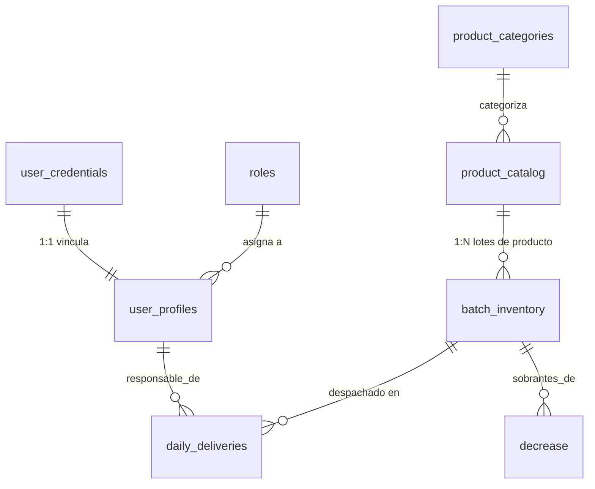

# Resumen Arquitectónico: Food School Backend

¡Felicidades! Hemos construido un sistema monolítico modular con principios empresariales. A continuación un resumen técnico de lo que tienes funcionando.

***

## 1. Tecnologías Clave implementadas
- **Entorno Servidor:** Node.js + Express.js.
- **Base de Datos:** PostgreSQL alojada de manera remota a través de [Supabase](https://supabase.com).
- **ORM / Query Builder:** [Drizzle ORM](https://orm.drizzle.team) para mapeo rápido y migraciones seguras a la nube mediante `drizzle-kit`.
- **Seguridad:** Autenticación de Tokens (`jsonwebtoken`) y cifrado irrompible de contraseñas (`bcrypt`).

## 2. Mapa Racional (Base de datos Modular)
Así se relacionan por el ecosistema las 7 tablas de tu base de datos centralizadas en la nube:

## 3. Disposición del Directorio 
Acoplamos tu sistema a una arquitectura `Controlador-Rutas` con un esquema de protección por middlewares. 

- `db/`
  - Instancia principal de conexión a RDS (Relational Database Service) cargando tus credenciales alojadas en el `.env`.
- `models/schema/`
  - Separación de responsabilidades de las tablas en 6 archivos para máxima limpieza visual: `roles.js`, `categories.js`, `products.js`, `users.js`, `inventory.js`, `operations.js`.
- `middlewares/`
  - `authMiddleware.js`: Es el guardaespaldas de la API. Revisa a dónde va la petición, intercepta el `Bearer Token`, y bloquea solicitudes no autorizadas (ej: un usuario normal tratando de crear otro usuario).
- `controllers/` y `routes/`
  - Modulados rígidamente en inglés siguiendo las mejores prácticas `camelCase`. Exportan únicamente JSON. Todos los flujos se concentran en `routes/index.js` y de ahí pasan a tu archivo maestro `server.js`.

## 4. Endpoints Generados
Todos los métodos integran protección interna anti-caídas `try/catch`. 

- **Seguridad (Auth)**
  - POST `/api/login` *(Genera el Token y devuelve todo el perfil personal con Joins)*.
- **Admin Users**
  - CRUD completo en `/api/users`. Ejecuta transferencias atómicas (Rollbacks en caso de que un perfil falle al crearse).
- **Catálogos API**
  - `/api/roles`, `/api/categories`, `/api/products` (Lectura Libre para logueados, **Escritura reservada a Administradores**).
- **Transacciones CRUD**
  - GET `/api/inventory`
  - POST `/api/attendance`
  - POST `/api/decreases`
  - POST `/api/deliveries` *(Esquema Crítico: Inserta el registro del despacho e instantáneamente descuenta por SQL el atributo `total_quantity` en la tabla maestra de lotes, evitando fallos de concurrencia).*

> [!TIP]
> Dado que Drizzle está enlazado a la carpeta `models`, cada que decidas agregar una nueva columna a cualquier módulo de tu base de datos, lo único que requerirás hacer después será lanzar tu comando de migración `npx drizzle-kit push` para actualizar todo en Supabase.
